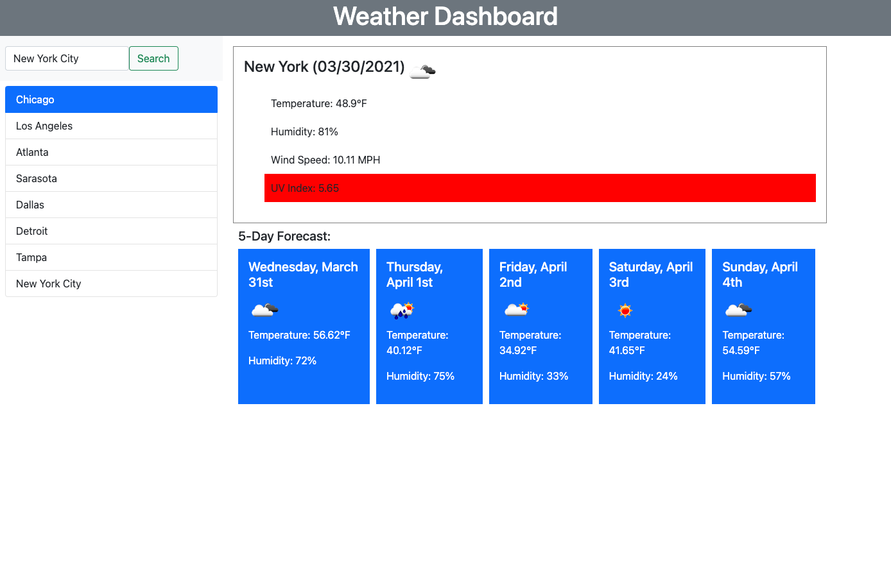

# weather-dashboard

## Description

This is a a weather dashboard that allows the user to search the current weather and 5-day weather forecast for any city in the US. The forecast shows the current date, temperature, wind speed, humidity, and UV index. The UV index is color coded to show red when the UV index is severe, yellow when it is moderate, and green when the UV index is favorable. The 5-day forecast shows the temperature and humidity for the next five days, along with corresponding weather icons. The buttons underneath the search bar will populate past searches as well.

# Deployed Site

Here's the site:
[Deployed Site](https://jdinh3.github.io/weather-dashboard/)
